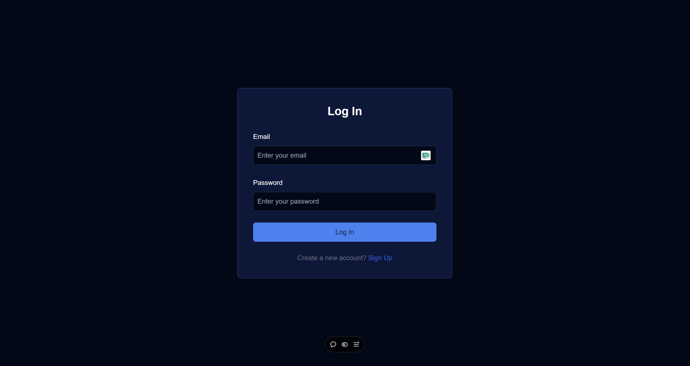
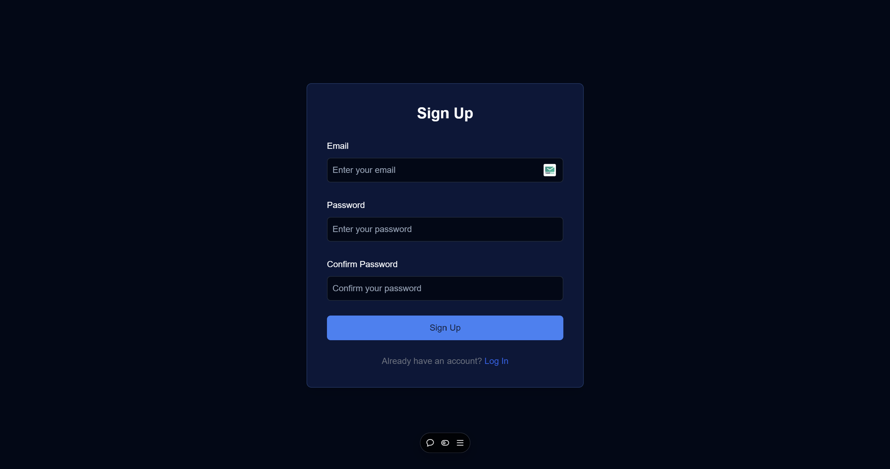
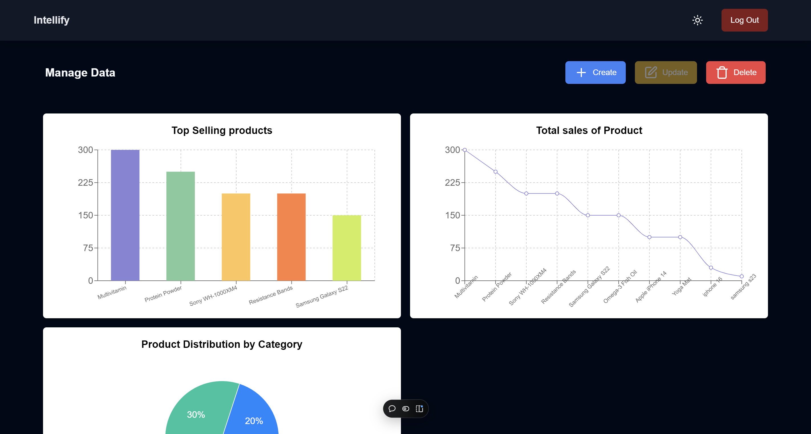
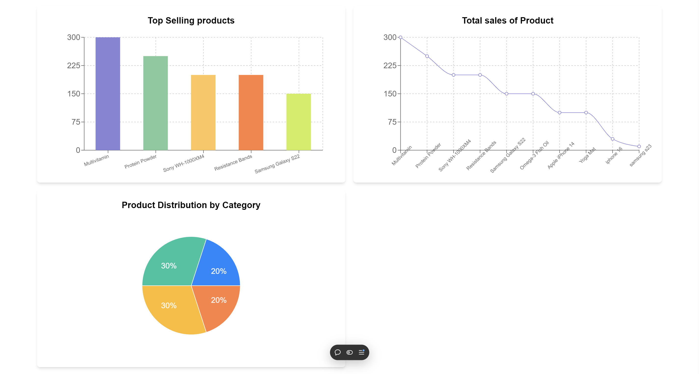

# **Dashboard Application**

> An interactive full-stack dashboard application built with Next.js, Supabase, and Recharts for real-time data visualization and user management. It was assigned to me as a project by Intellify. here is the live link of project [LINK](https://intellify-project.vercel.app/)

## **Table of Contents**
- [Features](#features)
- [Tech Stack](#tech-stack)
- [Setup Instructions](#setup-instructions)
- [Configuration](#configuration)
- [Usage](#usage)
- [Contributing](#contributing)
- [License](#license)

---

## **Features**
- User authentication and session management using Supabase.
- Real-time data updates using Supabase and TypeScript.
- Data visualization with Recharts.
- Dark mode toggle using `next-themes`.
- Responsive design with mobile sidebar navigation.
- Interactive dashboard for data visualization and user management.

---

## **Tech Stack**
- **Frontend:** Next.js (React, TypeScript), Tailwind CSS
- **Backend:** Supabase
- **Database:** Supabase (PostgreSQL)
- **State Management:** React Hooks
- **Data Visualization:** Recharts
- **Other Libraries:** `next-themes`, Lucide Icons

---

## **Setup Instructions**

### **Prerequisites**
- **Node.js** (v14+ recommended)
- **npm** or **yarn**
- A Supabase project (API keys and Supabase URL)

### **1. Clone the repository**

```bash
git clone https://github.com/your-username/intellify.git
cd intellify
```

### **2. Install Dependencies**

Run the following command to install all required dependencies:

```bash
npm install
# or
yarn install
```

### **3. Set up environment variables**

Create a `.env.local` file in the root directory and add the necessary environment variables. You will need the following variables for Supabase:

```bash
NEXT_PUBLIC_SUPABASE_URL=your_supabase_url
NEXT_PUBLIC_SUPABASE_ANON_KEY=your_supabase_anon_key
```

Make sure to replace `your_supabase_url` and `your_supabase_anon_key`` with the actual values from your Supabase project.

### **4. Run the development server**

Once the environment variables are set, start the development server:

```bash
npm run dev
# or
yarn dev
```

Open [http://localhost:3000](http://localhost:3000) in your browser to view the project.

### **5. Build the project (Optional)**

To create a production build, run:

```bash
npm run build
# or
yarn build
```

This will generate a production-ready build in the `out` directory.

---

## **Configuration**

### **Supabase Setup**

1. Set up a new project on [Supabase](https://supabase.io/).
2. Create necessary tables and configure authentication for users.
3. Add the Supabase API keys and URL to your `.env.local` file as shown above.

### **Dark Mode Toggle**

Dark mode is controlled via the `next-themes` library. It is enabled by default based on user system preferences and can be toggled manually via the navbar.

### **Real-time Updates**

Real-time updates for data visualization are powered by Supabase’s `on` subscription in your product dashboard.

### **Recharts Integration**

Recharts is used to create dynamic charts for data visualization. Ensure you have sample or live data in your Supabase database for chart display.

---

## **Usage**

### **Authentication**

The project uses Supabase for authentication. Users can log in with their email and password or create an account via the signup page.

### **Navbar**

- **Sign In/Out:** The navbar dynamically shows the login or logout button depending on the user’s session state.
- **Theme Toggle:** Switch between light and dark mode with the toggle button.

### **Dashboard**

- **Real-Time Data:** Real-time data updates are reflected in the dashboard using Supabase’s live subscriptions.
- **Charts:** Data visualizations using Recharts are shown for real-time data tracking.

### **Logout Functionality**

The logout functionality uses `supabase.auth.signOut()` to end the user session and redirect the user back to the login page.

---

### **Screenshots**

 
 
